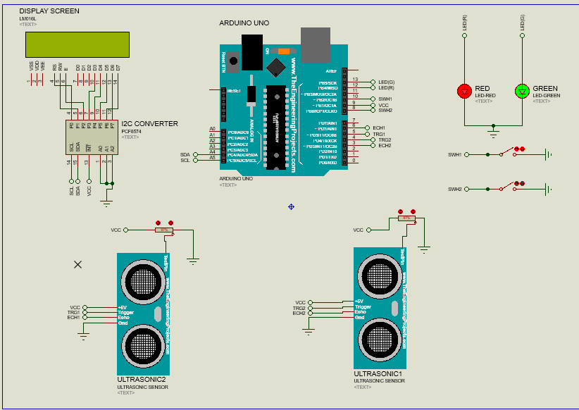

# <b> A Surgical Kit Box to Prevent Retained Surgical Items </b>

## <b> Objectives of the project </b>
 1. To reduce the number of deaths and injuries caused by misplaced surgical tools.
 2. To reduce the anxiety of patients and surgeons before and during surgery
 3. To maximize the efficiency of tool safety and enviroment cleanliness
 4. To save time during the final stages of the surgery.

## <b> Circuit Design </b>

## <b> Final Product </b>
